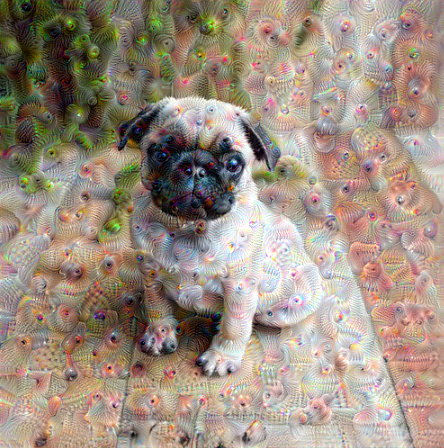
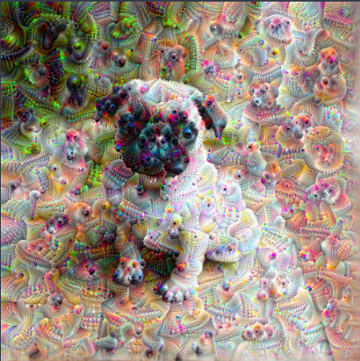

# Dreamify Image Using Neural Networks

# About

This is an experiment that visualizes the patterns learned by a neural network. Similar to when a child watches clouds and tries to interpret random shapes, Dreamify over-interprets and enhances the patterns it sees in an image.

it does so by forwarding an image through the network, then calculating the gradient of the image with respect to the activations of a particular layer. The image is then modified to increase these activations, enhancing the patterns seen by the network, and resulting in a dream-like image. This process was dubbed "Inceptionism"

# Results

# Pre-requisite downloads

If you don't already have tensorflow type the command into your terminal to install tensorflow:  
'''
pip install tensorflow
'''

# How to run

1. Download required packages  
2. set path to the photos (can be located locally or via https link)
3. run program and dreamify photo
